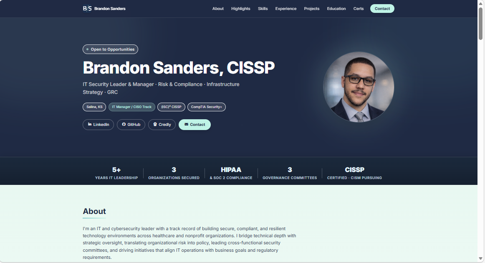
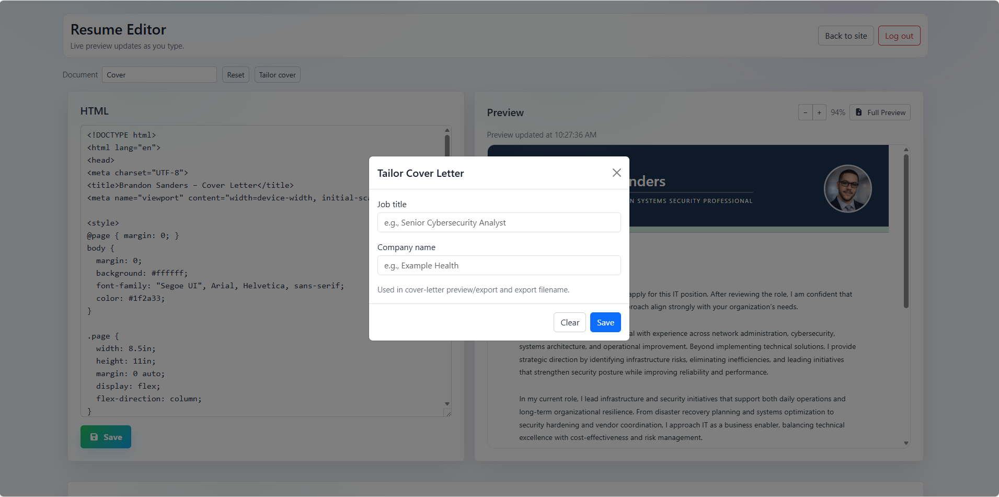
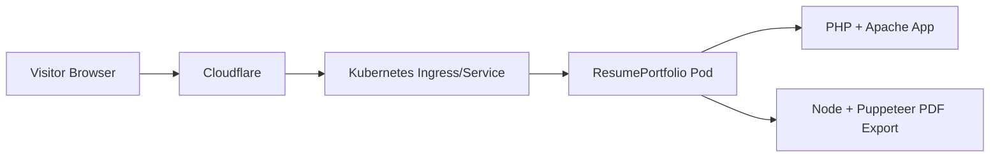

# My Cover Letter/Resume/Portfolio

This repository powers my personal resume website.

## About

This is my resume and portfolio site content for [brandonsanders.org](https://brandonsanders.org).



## Hosting

[brandonsanders.org](https://brandonsanders.org) is hosted on Kubernetes using the Docker image built from the `dockerfile` in this repository.
A prebuilt image is also available on Docker Hub at `brandonsanders/resumeportfolio`.

## Live Editing

This project allows me to edit my resume and cover letter on the fly through the built-in editor pages, so I can quickly update content without a full rebuild workflow.



## Run Locally

Build the image from this repository:

```bash
docker build -t resumeportfolio:local -f dockerfile .
```

Run the container with environment variables:

```bash
docker run --rm -p 8080:80 \
	-e RESUME_EDITOR_USERNAME=admin \
	-e RESUME_EDITOR_PASSWORD_HASH='$2y$10$replace_with_password_hash' \
	-e CONTACT_MAIL_USERNAME='you@example.com' \
	-e CONTACT_MAIL_APP_PASSWORD_B64='base64_app_password' \
	-e CONTACT_PHONE_NUMBER='555-555-5555' \
	-e CONTACT_PUBLIC_EMAIL='you@example.com' \
	resumeportfolio:local
```

Then open `http://localhost:8080`.

## Architecture



## Technical Details

### Stack and Runtime

- **Web runtime:** PHP 8.2 with Apache (`php:8.2-apache`) serves the site and editor UI.
- **Container image:** Built from this repository’s `dockerfile` and deployed in Kubernetes for `brandonsanders.org`.
- **PDF toolchain:** Node.js + Puppeteer + `pdf-lib` are installed in the same container to generate and post-process resume PDFs.

### How Deployment Is Accomplished

- The Docker image bakes the application source into `/app-source` and copies it to `/var/www/html`.
- `docker-entrypoint.sh` seeds `/var/www/html` from `/app-source` when a fresh/empty mounted volume is detected.
- Kubernetes runs this image as the web workload, so the same image handles both public site traffic and editor operations.

### Secrets and Environment Variables

Tokens, secrets, and private configuration are controlled through Kubernetes environment variables (typically from `Secret` and `ConfigMap` objects), not hardcoded in source files.

| Variable | Required | Purpose | Example |
|---|---|---|---|
| `RESUME_EDITOR_USERNAME` | Yes (for editor login) | Username for `/editor` authentication | `admin` |
| `RESUME_EDITOR_PASSWORD_HASH` | Yes (for editor login) | Password hash verified by `password_verify` | `$2y$10$...` |
| `RESUME_EDITOR_COOKIE_SECURE` | Optional | Forces secure editor session cookies (`true`/`false`) | `true` |
| `CONTACT_MAIL_USERNAME` | Yes (for contact form) | SMTP sender/recipient mailbox used by `contact.php` | `you@example.com` |
| `CONTACT_MAIL_APP_PASSWORD_B64` | Yes (for contact form) | Base64-encoded mail app password | `YXBwLXBhc3N3b3Jk` |
| `CONTACT_PHONE_NUMBER` | Optional | Phone token value injected into resume/cover templates | `555-555-5555` |
| `CONTACT_PUBLIC_EMAIL` | Optional | Public contact email shown in templates (falls back to mail username) | `you@example.com` |
| `CLARITY_PROJECT_ID` | Optional | Enables Microsoft Clarity snippet in the main layout | `abcd1234ef` |
| `PDF_OPEN_ALERT_MESSAGE_B64` | Optional | Base64 alert text injected into exported PDFs | `VGVzdCBtZXNzYWdl` |
| `PDF_OPEN_ALERT_MESSAGE` | Optional | Plain-text alert text fallback for exported PDFs | `Thank you for reviewing my resume.` |

### Kubernetes Deployment Notes

- Application image: `brandonsanders/resumeportfolio` (or build from this repo).
- Inject sensitive values from Kubernetes `Secret` and non-sensitive values from `ConfigMap`.
- Wire values into the pod via `env` / `envFrom` in your `Deployment`.
- Use persistent storage for `/var/www/html` if you want editor changes to survive pod recreation.

### How On-the-Fly Editing Works

- The editor is implemented in `editor/index.php` and manages both `Resume.html` and `Cover.html`.
- Authenticated sessions are required (`password_verify`-based login), with CSRF tokens on form actions.
- Saving writes edited HTML directly to the active document file using server-side file writes, making updates immediately available.
- Token placeholders (for contact/job/company values) are applied during export to personalize output without duplicating templates.

### How Export Is Accomplished

- For PDF export, the editor combines selected page HTML into a temporary document.
- It invokes `render-pdf.mjs` (Puppeteer + system Chromium) to print the HTML to a Letter-size PDF.
- It optionally invokes `pdf-add-alert.mjs` to embed JavaScript alert messaging inside the generated PDF.

## Security Notes

- I do not commit real credentials, password hashes, or app passwords to this repository.
- Store sensitive values in Kubernetes `Secret` objects and rotate them regularly.
- `RESUME_EDITOR_PASSWORD_HASH` should always be a strong hash produced by PHP password hashing.
- Keep `RESUME_EDITOR_COOKIE_SECURE=true` in HTTPS production environments.