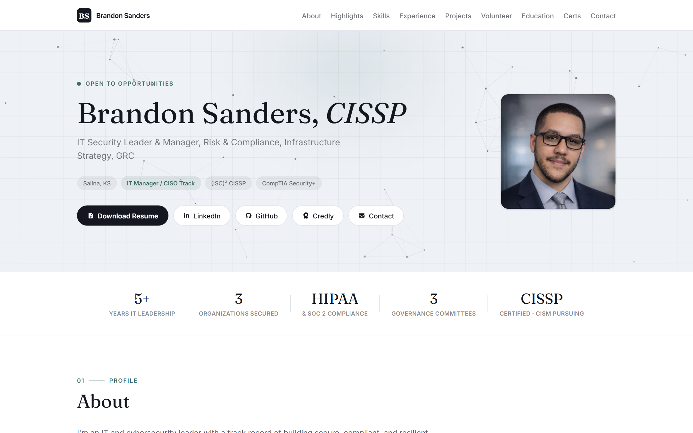
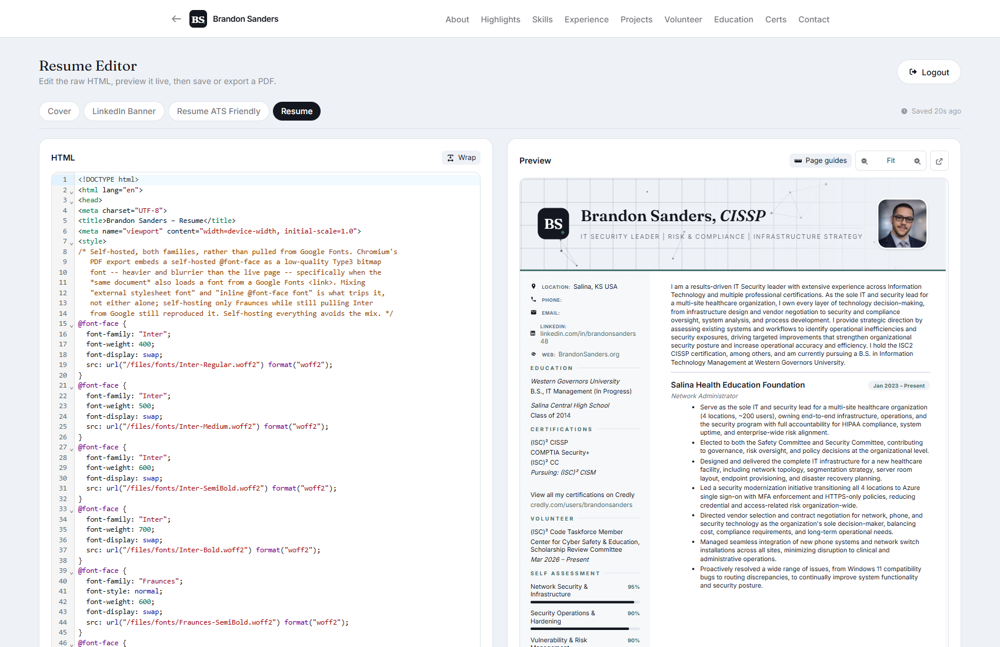
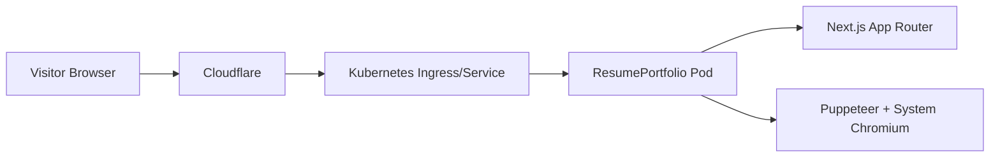

# My Cover Letter/Resume/Portfolio

This repository powers my personal resume website.

## About

This is my resume and portfolio site content for [brandonsanders.org](https://brandonsanders.org).



## Hosting

[brandonsanders.org](https://brandonsanders.org) is hosted on Kubernetes using the Docker image built from `next-app/Dockerfile` in this repository.
A prebuilt image is also available on Docker Hub at `brandonsanders/resumeportfolio`.

## Live Editing

This project includes a built-in `/editor` for the resume, cover letter, ATS-friendly resume, and LinkedIn banner, so I can update content, tailor a PDF to a specific role, and export/publish it without a full rebuild workflow.



## Run Locally

Build the image from this repository:

```bash
docker build -t resumeportfolio:local -f next-app/Dockerfile next-app
```

Run the container with environment variables:

```bash
docker run --rm -p 8080:3000 \
	-e RESUME_EDITOR_USERNAME=admin \
	-e RESUME_EDITOR_PASSWORD_HASH='$2y$10$replace_with_password_hash' \
	-e RESUME_EDITOR_SESSION_SECRET='replace-with-a-long-random-string' \
	-e CONTACT_MAIL_USERNAME='you@example.com' \
	-e CONTACT_MAIL_APP_PASSWORD='your-16-character-app-password' \
	-e CONTACT_PHONE_NUMBER='555-555-5555' \
	-e CONTACT_PUBLIC_EMAIL='you@example.com' \
	resumeportfolio:local
```

Then open `http://localhost:8080`. See `next-app/.env.local.example` for the full list of supported environment variables, including the optional Cloudflare Turnstile keys.

## Architecture


```mermaid
flowchart LR
	U[Visitor Browser] --> C[Cloudflare]
	C --> K[Kubernetes Ingress/Service]
	K --> P[ResumePortfolio Pod]
	P --> N[Next.js App Router]
	P --> X[Puppeteer + System Chromium]
```

## Technical Details

### Stack and Runtime

- **Web runtime:** Next.js 16 (App Router) on Node 20, styled with Tailwind CSS v4.
- **Container image:** Built from `next-app/Dockerfile` (multi-stage: deps → build → standalone runner) and deployed in Kubernetes for `brandonsanders.org`.
- **PDF/image toolchain:** Puppeteer drives a system-installed Chromium in the same container to export PDFs (and, for the LinkedIn banner, a PNG) and `pdf-lib` embeds an optional PDF-open alert. `sharp` can downscale/recompress embedded photos for a much smaller PDF.

### How Deployment Is Accomplished

- `.github/workflows/docker.yml` builds the image from `next-app/` on every push to `main` and pushes it to Docker Hub as `brandonsanders/resumeportfolio:latest` (and `:<sha>`).
- Kubernetes runs that image; deploying a new build there (image pull + rollout) is a separate step from the GitHub Actions build/push.
- `docker-entrypoint.sh` seeds `/app/content` (the editable Resume/Cover/etc. HTML) and `/app/public/files` (published PDFs) from read-only copies baked into the image, but only when the mounted volume is fresh/empty. This means edits made through `/editor` and PDFs published from it survive a redeploy instead of being overwritten by the new image's defaults.

### Secrets and Environment Variables

Tokens, secrets, and private configuration are controlled through Kubernetes environment variables (typically from `Secret` and `ConfigMap` objects), not hardcoded in source files. The full, current list lives in `next-app/.env.local.example`; the key ones:

| Variable | Required | Purpose |
|---|---|---|
| `RESUME_EDITOR_USERNAME` / `RESUME_EDITOR_PASSWORD_HASH` | Yes (for editor login) | Credentials for `/editor`; the password is verified with `bcryptjs` against a standard bcrypt hash. |
| `RESUME_EDITOR_SESSION_SECRET` | Yes (for editor login) | Signs the editor's session cookie (HMAC-SHA256). |
| `RESUME_EDITOR_BYPASS_LOGIN` | Optional | Skips the editor login screen entirely (local dev only). |
| `CONTACT_MAIL_USERNAME` / `CONTACT_MAIL_APP_PASSWORD` | Yes (for contact form) | SMTP sender/recipient mailbox and app password used by the contact API route. |
| `CONTACT_PHONE_NUMBER` / `CONTACT_PUBLIC_EMAIL` | Optional | Token values injected into resume/cover templates. |
| `PDF_OPEN_ALERT_MESSAGE` / `PDF_OPEN_ALERT_MESSAGE_B64` | Optional | Alert text embedded as JavaScript in exported PDFs. |
| `PUPPETEER_EXECUTABLE_PATH` | Production | Points Puppeteer at the container's system Chromium instead of downloading its own. |
| `CLARITY_PROJECT_ID` | Optional | Enables the Microsoft Clarity snippet (not injected on `/editor`). |
| `TURNSTILE_SITE_KEY` / `TURNSTILE_SECRET_KEY` | Optional | Cloudflare Turnstile keys; gate the contact form and resume download behind a bot check. Unset disables the check entirely. |

### Kubernetes Deployment Notes

- Application image: `brandonsanders/resumeportfolio` (or build from `next-app/Dockerfile`).
- Inject sensitive values from Kubernetes `Secret` and non-sensitive values from `ConfigMap`.
- Wire values into the pod via `env` / `envFrom` in your `Deployment`.
- Mount persistent volumes at `/app/content` and `/app/public/files` if you want editor edits and published PDFs to survive pod recreation.

### How On-the-Fly Editing Works

- The editor (`/editor`) is a client-only React app with a CodeMirror HTML editor, a live preview (auto-fit zoom, page-break guides for paginated docs), and doc tabs for Resume, Cover Letter, ATS-friendly Resume, and the LinkedIn banner.
- Authenticated sessions are required (HMAC-signed cookie), checked by middleware/route guards on every editor API call.
- Saving writes the edited HTML directly to its file on disk, making updates immediately available.
- `{{CONTACT_PHONE_NUMBER}}`/`{{TARGET_JOB_TITLE}}`-style token placeholders are applied at export/preview time to personalize output per job application without duplicating templates.

### How Export Is Accomplished

- For PDF export, the export route combines the selected page(s) into one document (optionally with embedded photos downscaled/recompressed first) and renders it with Puppeteer + system Chromium.
- The LinkedIn banner exports as a PNG instead: a direct element screenshot at its true 1584×396 size, since it's a graphic, not a paginated document.
- Fonts are self-hosted rather than pulled from Google Fonts at render time, which avoids a Chromium bug where a self-hosted `@font-face` gets embedded as a low-quality bitmap font when the same document also loads a font from an external stylesheet.
- An optional JavaScript alert (`PDF_OPEN_ALERT_MESSAGE`) can be embedded in the exported PDF via `pdf-lib`.
- The Resume PDF can optionally be "published" straight to `/files/Brandon-Sanders-Resume.pdf` on the live site from within the editor.

## Security Notes

- I do not commit real credentials, password hashes, or app passwords to this repository.
- Store sensitive values in Kubernetes `Secret` objects and rotate them regularly.
- `RESUME_EDITOR_PASSWORD_HASH` should always be a strong bcrypt hash.
- PDFs under `/files/` are only reachable via a same-site Referer (middleware-enforced), so they can't be trivially hotlinked or scraped directly by URL.
- The contact form and resume download are optionally gated behind Cloudflare Turnstile.
